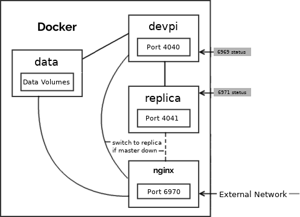

# dkdevpi

Docker-compose setup to run a local Python Package Index (PI).

Runs a [devpi][dp] container and a [replica][rep]
behind an [Nginx][nx] instance for maximal modularity.
Per default it caches the real Python Package index at pypi.org.
Packages that do not exist locally will be forwarded from there.
LDAP authentication is enabled for `root/test`.

[Video: Release Management with Devpi][erb]




# Running an instance

First you will have to copy `template_.env` to `.env` in the project root 
and edit the latter  to your linking.

Then you should generade an ssl certificate and key named `./nginx/dkdevpi.crt`/`.key` respectively.
You will probably want to generate it for both an IP and several DNS names and sign it with a root certificate.
That can be achieved most easily with a GUI-tool like [xca](xca)

After that, try your luck with `build.sh run`.
Remember `docker logs <containername>` is your friend and its `-f` and `--tail <number_of_lines>` options are, too.
Some packages inside the Dockerfiles are version-pinned.
That might cause their installation to fail as they are no longer available in that version.
Should that be the case, try to replace them with a more recent one and test the resulting setup carefully.

If everything went well, and you did not change the port setup, your package index should be reachable under:

```
http://localhost:6970/
https://localhost:6943/
```

#### Reset root password

Inside the devpi container run:

```
devpi-server --serverdir=/devpi/server --passwd root
```


# ToDo

- More and better documentation, sorry.
- Incorporate letsencrypt if no certificate provided
- Look into an actual devpi_ plugin for the modified theme
  * ...that allows changing a few strings in template
  * ...and doesn't need the `sed` hack

# License
This is a personal project.
The Author prefers if you ignored it, until it is ready.
All rights reserved for now.


[al]: https://hub.docker.com/_/alpine/
[1]: http://doc.devpi.net/latest/quickstart-server.html#versioning-exporting-and-importing-server-state
[dp]: https://www.devpi.net
[nx]: https://nginx.org
[xca]: https://sourceforge.net/projects/xca/
